  

  
   
  

  

### 👨‍💻 About Me

I’m Yurij, a web developer working mostly with **Laravel**, **PHP**, JavaScript and TypeScript.  
I build and maintain open-source Laravel packages, write tested production code with **Pest** and **PHPUnit**, and spend some of my free time experimenting with embedded systems and mobile development.

---

### 🧰 Tech Stack

**Main**  

**Frontend**  

**Backend & Data**  

**Testing & Tooling**  

**Infrastructure**  

**Other Technologies**  

**Currently Learning & Exploring**  

---

### 📬 Connect with me

---

### Statistics

  
  

### Pinned

